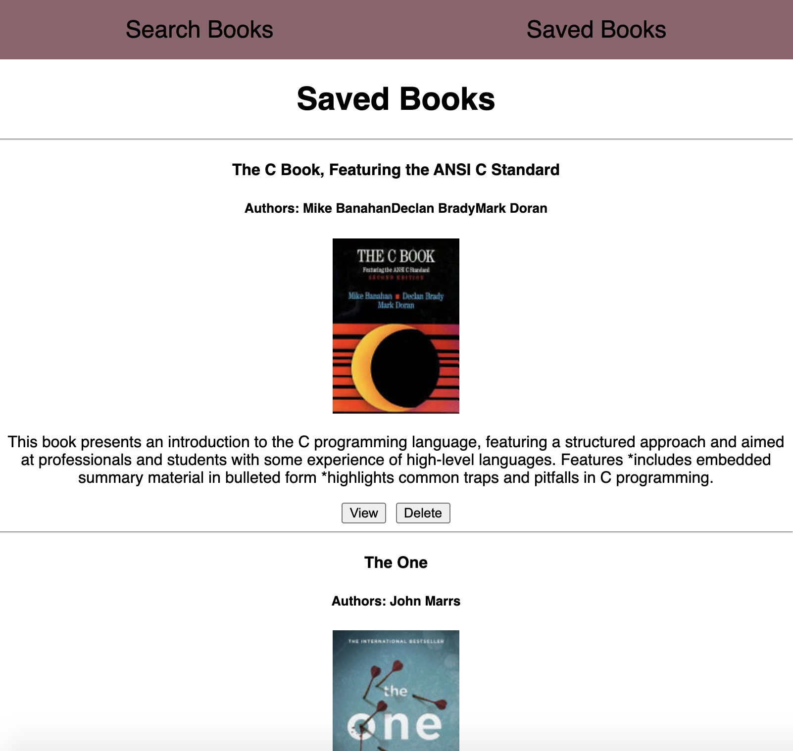

# Google Books Search
  

  ## Description
  A React-based book search app utilizing the Google Books API. A book can be saved into a Mongo Database and displayed on the "saved" page

  ## Table of Contents
  - [Installation](#Installation)
  - [Credits](#Credits)
  - [Usage](#Usage)
  - [Questions](#Questions)
  - [License](#License)

  ## Installation
  Clone the repository, run npm i, and then npm start

  ## Credits
  Sahar Vacnich, Google-Books API

  ## Usage
  Search the book you are interested in, when prompted with results, add the desired book and save it. Save books will be viewed in the "saved" page with the ability to delete any book, thus removing it from the databse

  ## Questions
  [link to my GitHub!](https://github.com/saharVac)
  
  [Email me!](mailto:vcsahar@gmail.com)
  

  
